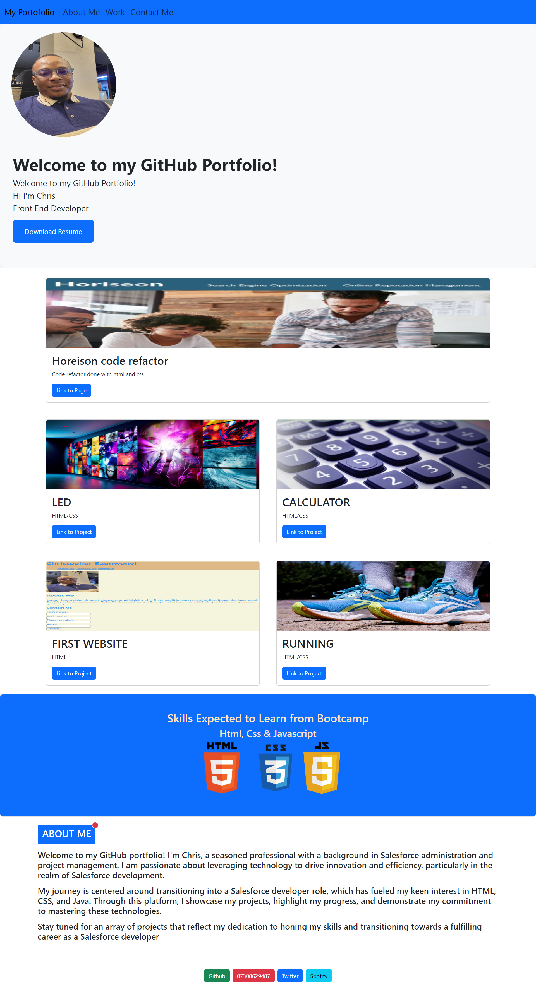

# Bootstrap-Portfolio
Project Title: Website Redesign with Bootstrap
Overview
This project involves the redesign of an existing webpage using Bootstrap, a powerful front-end framework known for its responsive and mobile-first approach. The goal was to enhance the page's aesthetics, responsiveness, and user experience.

Project Description
Purpose
The purpose of this project was to revamp the layout, design, and functionality of an already deployed webpage by integrating Bootstrap's robust features. The redesign aimed to improve visual appeal, optimize responsiveness across various devices, and streamline the overall user interface.

Technologies Used
HTML5/CSS3
Bootstrap 5

Key Features
Responsive Design: Implemented Bootstrap's grid system and components to ensure a mobile-first and responsive layout for seamless user experience on various devices.
Enhanced UI Components: Utilized Bootstrap's pre-styled components (such as navbar, cards, forms) to modernize the UI while maintaining consistency and aesthetics.
Customization: Tailored Bootstrap classes and components to suit the design requirements and improve the visual appeal of the webpage.
Deployment
The redesigned webpage is deployed and live here. [Provide the link to the live webpage]

[Credits to www.logolynx.com for the html, css and java logo used in the skills sections]

Conclusion
The integration of Bootstrap significantly improved the aesthetics and responsiveness of the existing webpage. This project demonstrates the effectiveness of Bootstrap in revamping web designs for modern user experiences.

 [Deployed page on GitHub Pages](https://christopher-eze.github.io/Bootstrap-Portfolio/)

 
 Screenshot of the deployed page on Github:

 Links to the Previous deployed Page without bootstrap:
[Deployed page on GitHub Pages](https://christopher-eze.github.io/myPortfolio/)